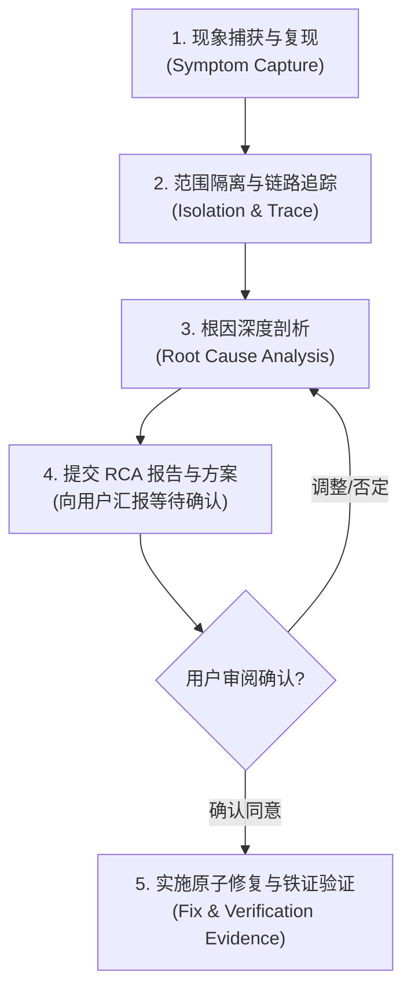

# 系统化 Bug 排查与根因修复工程规范技能 (Systematic Debugging Skill)

## 概述 (Overview)

本技能定义了研发工程师与 AI 编码助手在面对生产缺陷、异常报错、性能劣化或逻辑故障时的**系统化排障思考链路（Methodology）、沟通契约与工程红线**。

吸纳业界著名工程纪律（如 `obra/superpowers` 的资深工程师严谨纪律与 SWE-bench 门禁），彻底摒弃凭感觉猜测（Vibe Debugging）。AI 在排障时最致命的错误是：**“跳过思考直接改代码”**、**“好心办坏事——静默添加重试或兜底默认值掩盖真问题”**，以及**“改完代码凭空声称已修复，没有真实命令测试铁证”**。本技能旨在将顶尖架构师的诊断智慧工程化，确保每一次排错都做到：**机理清楚、因果明确、方案受控、铁证闭环、无副作用**。

---

# 1. 排障核心红线（四大绝对铁律）

在进入代码排查与修改前，必须时刻无条件遵守以下铁律：

### 🚨 铁律一：严禁先斩后奏，坚决禁止直接盲改代码 (No Blind Patching)
- 遇到报错或用户要求修复 Bug 时，**严禁直接修改代码并丢给用户一个改动后的版本**。
- **强制执行机制**：必须先指出 Bug 的根本原因（Root Cause）、复现逻辑以及潜在影响，提供明确的修复方案。**待用户审阅确认后，方可进行代码修复**。

### 🚨 铁律二：坚决禁止静默添加重试或降级兜底 (No Silent Fallback/Retry)
- 在排查或修复过程中，若认为某些逻辑可能网络抖动或失败，**坚决禁止静默加入自动重试（Retry）、默认值兜底（Fallback）或数据补偿逻辑**（例如私自加 `try...except: return {}` 或无脑包裹重试装饰器）。
- **必须履行的告知义务**：必须主动向用户分析：
  1. 为什么要加重试/兜底？
  2. 潜在副作用与风险是什么？（如：非幂等接口重试导致重复扣款/重复建单、默认值导致脏数据写入落库掩盖真正故障等）。
  3. 备选方案有哪些？
  **只有在获得用户的明确确认后，方可编码实现**。

### 🚨 铁律三：最小破坏性原则 (Minimal Invasive Fix)
- 修复必须直击 Bug 根因，保持改动的高内聚与原子性。
- **严禁借修复 Bug 之名进行大范围无关代码重构**或调整无关业务逻辑，严禁扩大改动面导致新的未知次生 Bug。

### 🚨 铁律四：完成前铁证验证门禁 (Verification Evidence Gate)
- **严禁口头声明已修复**：严禁在未经过真实终端命令验证的情况下，口头告诉用户“已修复/已测试通过”。
- **铁证交付标准**：在宣布修复完成前，必须真正在终端执行检验命令（单测、curl 请求、构建检查），向用户展示：
  1. 具体的执行命令字符串；
  2. 命令退出码（Exit Code 0）；
  3. 实际通过的断言输出（Pass Evidence）或结构化响应日志。

---

# 2. 系统化排障标准流水线 (SOP 5-Stage Pipeline)

面对任何复杂 Bug，排查思考必须严格遵循以下五步闭环：



---

## 阶段 1：现象捕获与复现 (Symptom Capture)
- **收集完整上下文**：抓取精确的错误堆栈（Stack Trace）、错误日志行、请求入参 Payload、环境标识（Local/Dev/Prod）；
- **寻找边界条件**：是全量必现还是偶发？是否由特定特殊字符、空值（Null/Nil）、大数值溢出、并发冲突或网络超时触发？

## 阶段 2：范围隔离与链路追踪 (Isolation & Trace)
- **划定故障扇区**：
  - 接入层故障？（Nginx/网关、路由匹配错误、参数反序列化失败）
  - 业务编排层故障？（分支流转错误、状态机异常转换、并发脏写）
  - 依赖资源故障？（数据库死锁、连接池满、Redis 缓存穿透、第三方 API 超时）
- **利用各语言专属调试武器**：结合对应语言 Skill 提供的排错工具（如 Go `pprof`/`race`，Python `faulthandler`/`asyncio` debug）定位具体执行点。

## 阶段 3：根因深度剖析 (Root Cause Analysis - RCA)
- 必须回答三个核心问题：
  1. **Direct Cause（直接诱因）**：是什么直接导致了 Panic / 异常？（例如切片越界、空指针解引用、连接未释放）。
  2. **Root Cause（根本原因）**：为什么系统会走到这一步？（例如前置校验缺失、并发状态未加锁、生命周期管理错位）。
  3. **Why Not Caught Earlier（为什么此前没测出来）**：单元测试缺失了哪种边界用例？

## 阶段 4：提交 RCA 报告与修复方案 (等待确认)
必须整理出精炼结构化的 **根因分析报告（RCA Report）** 向用户说明，格式参考下文模板。

## 阶段 5：实施原子修复与铁证验证 (Fix & Verification Evidence Gate)
- 经用户确认后，采用最精确的代码修改；
- **自愈与回归验证铁证**：
  - 先跑红灯测试验证 Bug 存在（Red Test）；
  - 修复后跑绿灯测试（Green Test），并在终端真实执行；
  - 汇报中提供执行命令、Exit Code 0 与测试断言输出，杜绝空口无凭。

---

# 3. 标准根因报告模板 (RCA Report Template)

在向用户提交修复方案时，强制使用以下结构化模板表达：

```markdown
### 🩺 Bug 根因分析报告 (RCA Report)

#### 1. 故障现象与复现链路
- **故障描述**：[清晰一句话说明故障现象]
- **触发路径**：[请求入参/前置操作 -> 触发的方法/代码行]

#### 2. 根因深度剖析 (Root Cause)
- **直接原因**：[直接触发报错的代码逻辑，如 nil 判空遗漏]
- **深层机理**：[为什么会产生这种状态，例如并发协程乱序、生命周期提前终结等]

#### 3. 拟定修复方案与备选对比
- **方案 A (推荐)**：[说明改动逻辑，为什么是最优解]
- **方案 B (备选)**：[说明备选思路]
- **涉及文件**：[精确列出待修改的文件与影响范围]

#### 4. 副作用与风险评估 (Risk Assessment)
- **是否破坏现有兼容性**：否 / 是（说明原因）
- **是否涉及重试/兜底**：若涉及，必须在此显式提示风险并获得确认！

#### 5. 验证命令与铁证标准 (Verification Command & Evidence)
- **检验执行指令**：`go test -v -run TestXxx ./...` / `pytest tests/test_xxx.py`
- **预期验收证据**：Exit Code 0，断言全部通过，消除现场报错。

> 💡 请审阅以上根因剖析与修复思路。如无疑问，请回复确认，我将立即实施原子修复并出具真实命令验证铁证。
```

---

# 4. 跨语言排障协同与武器库对接

本技能负责**全局方法论与决策流程**，在执行具体语言排查时，主动协同各语言专业 Skill 调取对应武器库：

| 目标技术栈 | 协同专业 Skill | 重点排障方向与武器库 |
| :--- | :--- | :--- |
| **Go 语言 / 微服务** | `agent-skill-go-zero` | Goroutine 泄漏、未捕获 Panic、Data Race 竞争检测 (`-race`)、慢查与连接池饱和。 |
| **FastAPI / Python Web** | `agent-skill-python-fastapi` | 事件循环防阻塞检测 (`PYTHONASYNCIODEBUG=1`)、SQLAlchemy 连接泄漏、统一业务异常未拦截。 |
| **Python 爬虫与逆向** | `agent-skill-python-crawler` | 429 频控封禁、TLS/JA3 指纹识别拦截、Playwright 内存膨胀、页面 DOM 结构突变。 |
| **Python 脚本与 CLI** | `agent-skill-python-scripting` | 外部命令挂死 (无超时)、标准退出码异常、流式大文件内存溢出 (OOM)。 |
| **PHP / Hyperf** | `hyperf-framework` | Swoole 协程上下文穿透污染、静态变量逃逸、长连接失活与队列堆积。 |

---

# 5. 排查修复 Checklist

- [ ] 是否已向用户清晰解释 Bug 的直接诱因与根本机理？
- [ ] 是否在动手改代码前向用户提交了方案并获得了明确确认？
- [ ] 是否坚决杜绝了私自添加静默重试（Retry）或默认值兜底（Fallback）？
- [ ] 代码修改是否符合最小破坏性原则，没有夹带大面积无关修改？
- [ ] 是否在终端真实运行了验证命令，并附带了 Exit Code 0 与测试输出铁证？
- [ ] 若属于高价值/深机理 Bug，是否已沉淀归档至 docs/04_operations/post_mortems/？

---

# 6. 高级排障门禁：红绿灯测试先行与事后五步复盘 (Advanced Diagnostic Guardrails)

吸纳业界顶尖工程门禁（SWE-bench 与 `obra/superpowers`）：

### 6.1 红绿灯测试硬门禁 (Failing Test First - 核心红线)
- **红灯用例 (Red Test)**：
  在动手修改任何生产代码之前，**必须先编写一个能够 100% 稳定复现当前 Bug 的失败测试用例**（运行断言报错，显示现场相同的堆栈）。
  *作用：证明 Bug 已被精准隔离，且排除了偶发环境干扰。*
- **绿灯验证 (Green Test)**：
  经审阅确认并完成原子修复后，再次执行该测试用例，必须顺利通过（绿灯）。
  *作用：该用例自动合入仓库回归用例集，形成永久性防回潮免疫资产。*

### 6.2 事后复盘追问五步法 (Post-Mortem 5-Whys)
在提交 RCA 总结时，必须包含以下防患于未然的深度思考：
1. **为什么代码在此刻崩溃？**（直接诱因：切片越界/空指针）
2. **为什么前置逻辑传递了非法状态？**（上游缺少合法性过滤）
3. **为什么编译期与静态检查没有告警？**（类型推导缺陷或 Linter 规则缺失）
4. **为什么现有的 CI 单元测试未能拦截？**（单测盲区：未覆盖边界空值）
5. **我们如何从流程/工具链上根绝同类问题？**（补充统一校验中间件或 CI 自检钩子）

### 6.3 历史回归快速二分法 (Git Bisect)
对于“之前一直正常，某次上线后突发异常”的历史回退缺陷，禁止无脑人肉翻找提交。
执行自动化二分查找：
```bash
git bisect start
git bisect bad HEAD                  # 当前版本有 Bug
git bisect good <known-good-commit>  # 上一个确定正常的版本
git bisect run go test ./...         # 自动运行单测直至揪出破坏者 Commit
```

### 6.4 高价值故障归档与永久免疫沉淀 (Post-Mortem Archiving)
当排查并修复的缺陷属于**高价值深度 Bug**（涉及并发竞态、隐蔽资源泄漏、第三方反直觉黑盒行为、状态机隐蔽非法跃迁）时：
- **禁止排障随风而逝**：严禁修复后不留痕迹导致未来同类 Bug 再次发生；
- **强制归档沉淀**：严格遵循 `project-documentation` 技能规范，将 RCA 报告、错误反例与优雅解法、防回潮单测收录归档至项目文档库：
  `docs/04_operations/post_mortems/case_YYYYMMDD_<topic>.md`；
- 将故障教训转化为系统永久免疫资产，为后续人类开发者与 AI Agent 树立明确的防坑路标。
